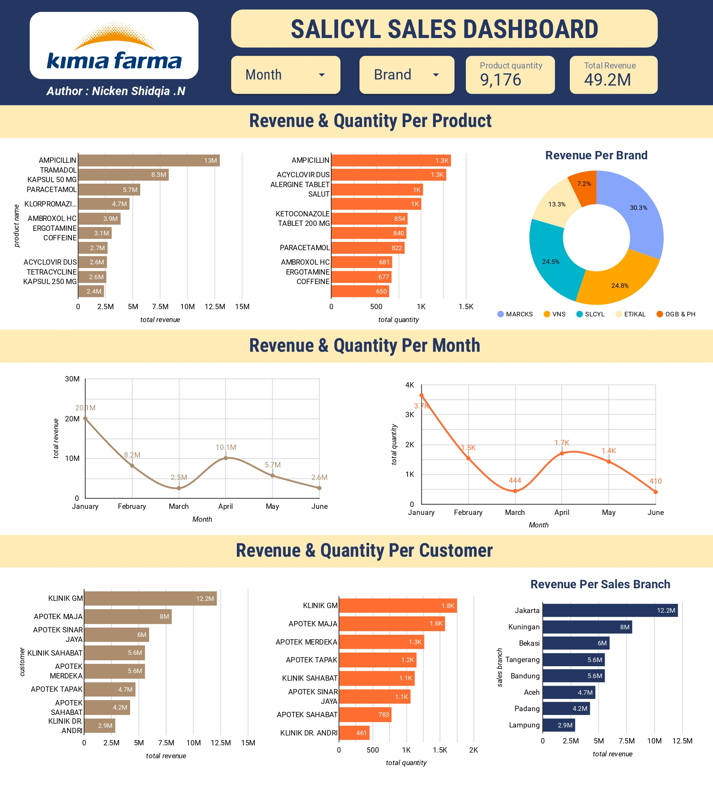

# Big Data Analytics Project Salicyl Sales Dashboad on Kimia Farma

## Project Description

**Challenges :**

- Create a datamart design (Consisting of base tables and aggregate tables)
- Create a salicycl sales data visualization dashboard
- Create insights and provide additional complementary data

## Project Goal

The project aims to empower the pharmaceutical company with a robust analytical infrastructure and actionable insights to drive informed decision-making in the realm of salicylic acid sales

## Tools & Library Used

  
  

## Project Result

[Click here to get dashboard link](https://lookerstudio.google.com/reporting/8acda551-6e3e-4638-ae4f-3e9a20847100)

### Base Table

A base table is a fundamental table that stores raw or detailed data at the most granular level.  

### Aggregate Table

An aggregate table is a summary table that stores precomputed results of aggregations or calculations based on the data in base tables.

#### Sales per date

    
  
#### Sales per customer  
  
  
#### Sales per product
  
  
#### Sales per branch
  
  
### Dashboard Visualization  
   
  
### Insight  
**All Kimia Farma Brand Sales**  
- The highest revenue based on product category is Ampicillin with 13 M and total quantity 1.3K 
- The highest revenue based on brand category is Marcks with 30.3%,  followed by VNS 24.8%, and SLCYL 24.5%.
- The highest revenue based on sales branch category is Jakarta with 12.2 M.
- Sales of Kimia Farma are fluctuating with the highest revenue is happened on January 2022 with 20.1 M, while the lowest revenue is happened on March 2022 with 2.5 M
- The highest revenue based on customer category is Klinik GM 12.2 M with total quantity 1.8K.   
  
**Salicyl Brand Sales**   
- The highest revenue based on product category is Paracetamol with 5.7 M and total quantity 840. 
- The highest revenue based on sales branch category is Jakarta with 5.6 M.
- Total revenue of sales Salicyl product is 12 M with total quantity 1,892.
- The highest revenue based on customer category is Klinik GM 5.6 M with total quantity 880.  
  
### Additional Complementary Data  
**Geographic Information:**
- Latitude and longitude of each distributor’s and brach location
- City, state, or region where distributors and brach are located.

**Promotional Activities:**

- Promotion Type, example discounts, bundle offers, seasonal promotions.
- Promotion Duration : Start and end dates for each promotional activity.
- Promotion Channels: Where the promotions are advertised or offered (in-store, online, specific platforms).

**Competitor Data:**

- Competitor Product Information
- Competitor Pricing
- Market Share
- Promotional Strategies
- Customer Reviews and Feedback
